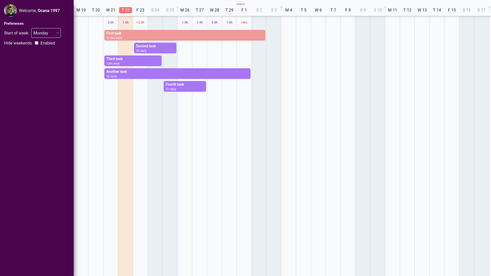

# Toggl Plan Take Home Project

## Project info

Dear reviewer, here are some infos to help you review my project:

- All the features of the app are in separate [pull requests](https://github.com/michellocana/fe_interview_homework/pulls?q=is%3Apr), and all pull requests have a video attached showcasing each feature.
- Please take into account that this is the result of 1 week of experience in both Svelte and Tailwind, it's almost certain that I'm not following some of the best practices in those technologies, but I can guarantee that I can learn that over time 🙂.

## Features

- Auth
  - Login implemented and access token is stored in the local storage
  - Show user info from the "/me" endpoint
- Preferences
  - Option to change the "start of week" user preference
  - Option to change the "hide weekends" user preference
- Tasks
  - Show tasks from the "/tasks" endpoint
  - Place tasks taking the "weight" property into account
  - Drag and drop tasks horizontally
  - Display the remaining time of each day that has tasks
  - Display the daily amount of time that each task consumes
  - Timeline view reflecting the "start of week" and "hide weekends" preferences
  - Display week numbers, week days and months just like the actual Toggl Plan
- Misc
  - Fully responsive and cross-browser tested layout
  - Drag and drop option working both on desktop (mouse) and mobile (touch)

## The Mission

Hello there future Toggl Plan Frontend Engineer! We're excited to see what you can do. Your mission, should you choose to accept it, is to replicate a simplified version of the team timeline view in [Toggl Plan](https://plan.toggl.com/). To do this you'll need to create a new Toggl Plan account on our staging server: https://plan.toggl.space and use the API to fetch the data you need.

Some notes:

- The template is already set up with a basic Svelte+Tailwind+Vite setup. Feel free to add any other libraries you want.
- The data should be fetched from our staging API. You can use `https://api.plan.toggl.space/api/v6-rc1/{workspace_id}/tasks?since={yyyy-mm-dd}&until={yyyy-mm-dd}&short=true&team={team_id}` endpoint.
- There is no need to consider task assignees. Place all tasks in one swimlane.
- No need to implement authentication, just keep the auth token, workspace ID, and team ID in local storage.
- Since / Until dates can be +- 1 week from current date.
- Focus on placing tasks on the timeline (in a Tetris-like manner, "weight" property is used to place tasks vertically), and set up a basic drag and drop functionality (move task horizontally). Vertical drag and drop is not required.
- Changes to data should not be persisted to the API. Just keep them in memory.
- No need to replicate the exact UI

## Getting Started

The first step is to fork this repo so that a fork exists on your own GitHub account. After you have forked the repo, clone your forked version down onto your machine.

Install the repo's dependencies:

`pnpm install`

Then start the local server:

`pnpm run dev`

Please remember to commit often so we can see how you're doing 🙌

## Deploy

No need to deploy the project anywhere. Just send us a link to your forked repo.

## Help

You can reach me at `vadim.kotov@toggl.com` to seek any clarifications.

Have fun!
